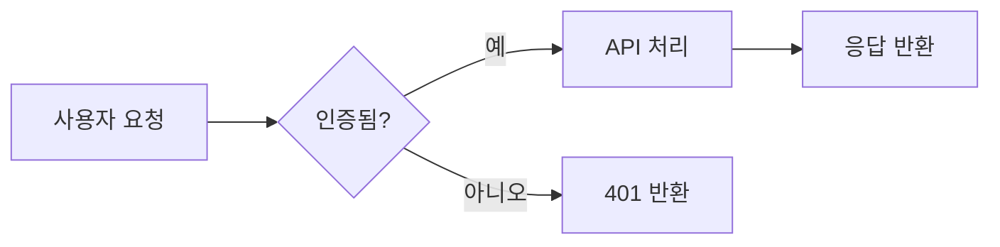
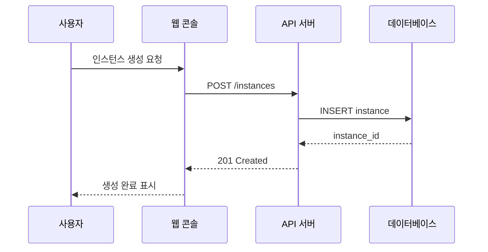
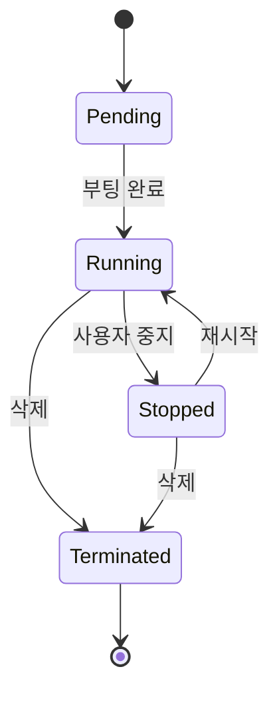
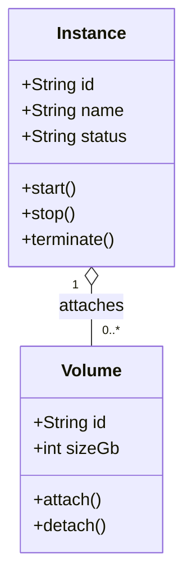

# Mermaid 샘플

이 문서는 mkdocs 에서 [mermaid](https://mermaid.js.org/) 다이어그램이 정상적으로 렌더링되는지 확인하기 위한 샘플입니다.

## 플로우차트

```mermaid
flowchart LR
    A[사용자 요청] --> B{인증됨?}
    B -- 예 --> C[API 처리]
    B -- 아니오 --> D[401 반환]
    C --> E[응답 반환]
```

## 시퀀스 다이어그램

```mermaid
sequenceDiagram
    participant U as 사용자
    participant W as 웹 콘솔
    participant A as API 서버
    participant DB as 데이터베이스

    U->>W: 인스턴스 생성 요청
    W->>A: POST /instances
    A->>DB: INSERT instance
    DB-->>A: instance_id
    A-->>W: 201 Created
    W-->>U: 생성 완료 표시
```

## 상태 다이어그램

```mermaid
stateDiagram-v2
    [*] --> Pending
    Pending --> Running: 부팅 완료
    Running --> Stopped: 사용자 중지
    Stopped --> Running: 재시작
    Running --> Terminated: 삭제
    Stopped --> Terminated: 삭제
    Terminated --> [*]
```

## 클래스 다이어그램

```mermaid
classDiagram
    class Instance {
        +String id
        +String name
        +String status
        +start()
        +stop()
        +terminate()
    }
    class Volume {
        +String id
        +int sizeGb
        +attach()
        +detach()
    }
    Instance "1" o-- "0..*" Volume : attaches
```
